# Exercise 3

The purpose of this exercise is to familiarize you with the basics of **AWS Service Catalog**. **Service Catalog** enables you to convert your **CloudFormation** templates into products that other users may deploy and use. This functionality is often used by enterprise customers where users do not have access to deploy their own cloud formation templates and only approved templates in form of ServiceCatalog products can be deployed.
In order to perform this exercise you will need to have access to AWS console.

## Creating test user account

In order to illustrate how **Service Catalog** works, we will need to create a test user account with access to AWS console. In the command below, replace PASSWORD string with a password of your choice.

```
aws iam create-user --user-name ServiceCatalogUser
aws iam create-login-profile --user-name ServiceCatalogUser --password PASSWORD --no-password-reset-required
```

Next we need to attach some security policies so that our user can use **S3** and **Service Catalog** services:

```
aws iam attach-user-policy --user-name ServiceCatalogUser --policy-arn arn:aws:iam::aws:policy/AmazonS3FullAccess
aws iam attach-user-policy --user-name ServiceCatalogUser --policy-arn arn:aws:iam::aws:policy/AWSServiceCatalogEndUserFullAccess
```

## Creating a Service Catalog product

Products in service catalog are grouped into portfolios and we will start with creating one. Then we will create a product, allow users to access the portfolio and finally deploy the product.

1. Within your web browser navigate to aws console (https://aws.amazon.com/) and sign in with your credentials
2. In the console's search bar type "Service Catalog" and navigate to Service Catalog page
3. In the left hand side navigation bar click "Portfolios". You should see empty list of product portfolios:
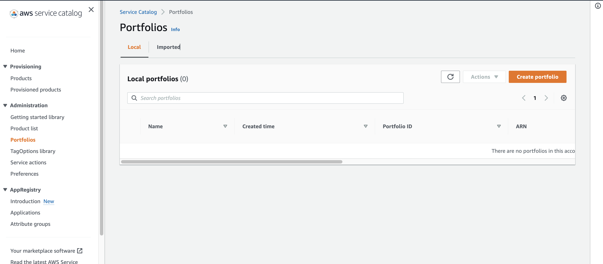
4. Click "Create Portfolio" and fill in the **Portfolio Name** and **Owner** fields.
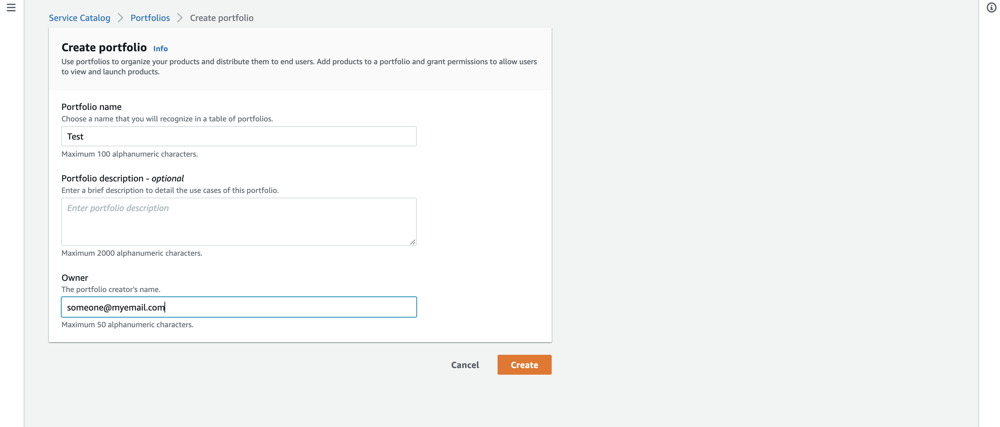 Click "Create" button to create product portfolio.
5. Once you have completed step 4. your **portfolio** will be visible in the list of local portfolios: 
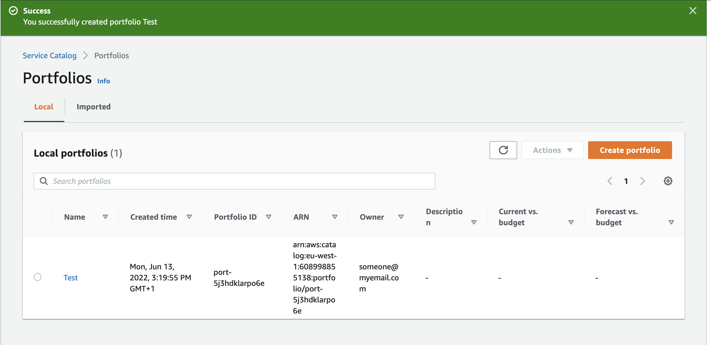
6. The next step involves creating a **product**. Click on the hyperlink with the name of the portfolio to get to its detail screen. At this stage the list of products will be empty. 
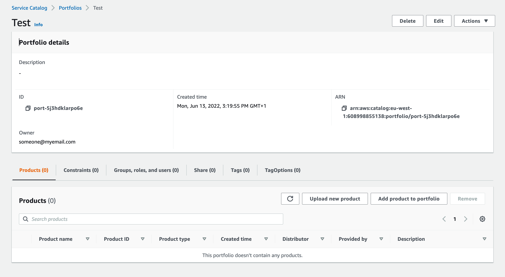
7. In the portfolio details screen, click **Upload new product** to create one. You will need to provide **Product name**, **Owner** and upload CloudFormation template. Use template for the s3 bucket from Exercise1. 
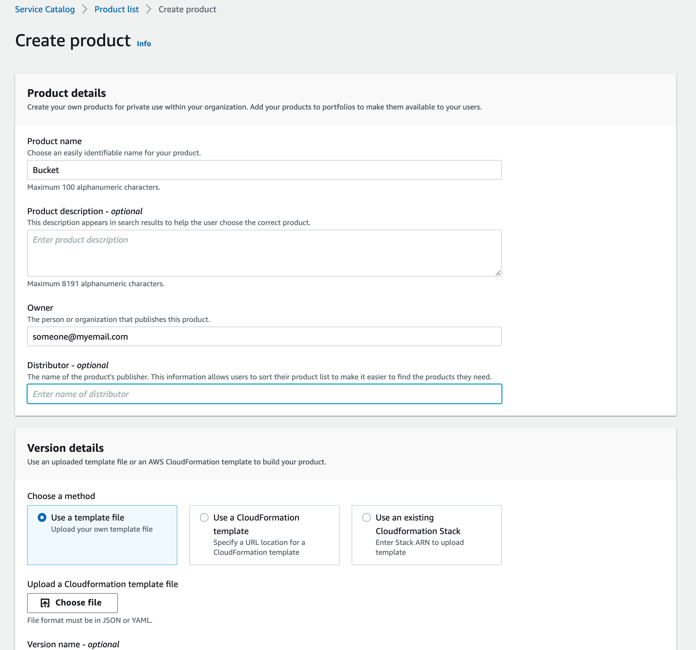
8. Once you click the **Create Product** button your product will be created. 
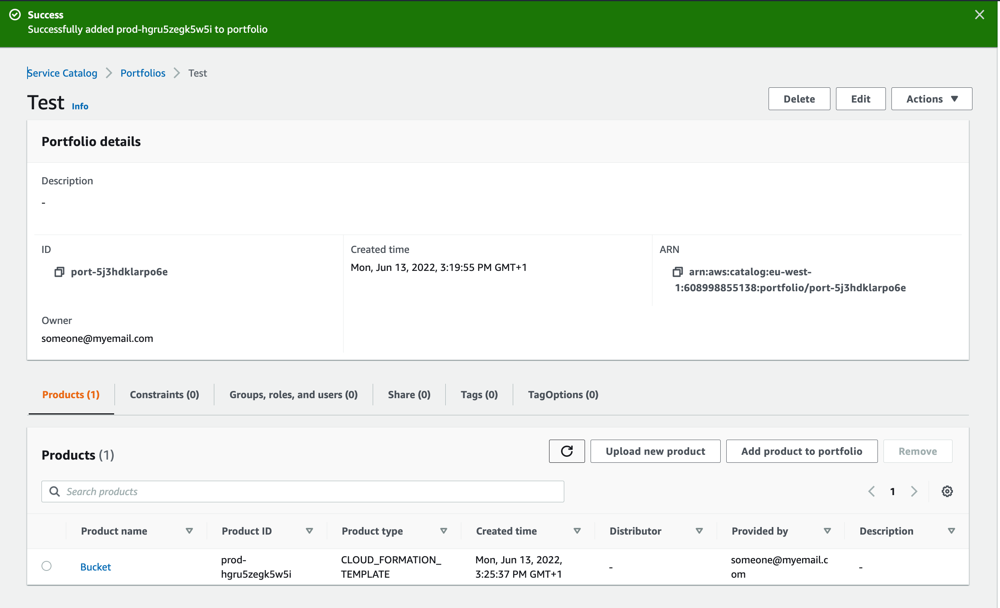
9. Now we have to allow users to access the product. In the portfolio details page, click on the **Groups, roles and users** tab and then click **Add groups, roles, users** button
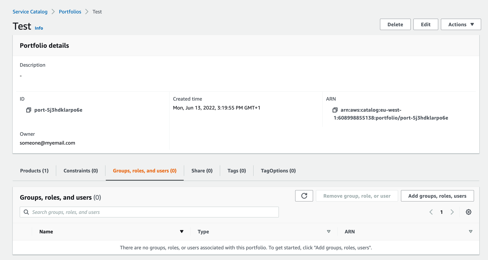
10. You should be presented with the screen that allows granting access to product to either groups, roles or users. Click on the **Users** tab, select the **ServiceCatalogUser** acount and click **Add Access** button.
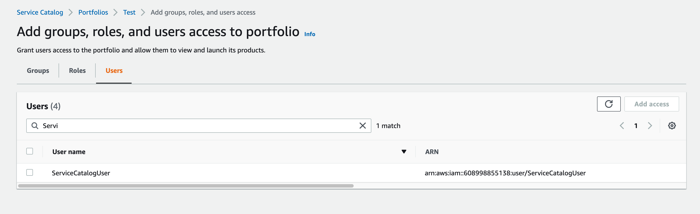

At this stage, the product is ready to be used by our **ServiceCatalogUser** account. In practice, rather than granting access to individual users you would grant access to user groups or roles that users can assume.

## Testing the Service catalog product

In order to test our product, we need to login to the console with **ServcieCatalogUser** credentials. In order to do that open new incognito/anonymous window in your browser and navigate to https://aws.amazon.com
1. Select sign in with **IAM User**, type your account id and **ServiceCatalog** user credentials in order to login.
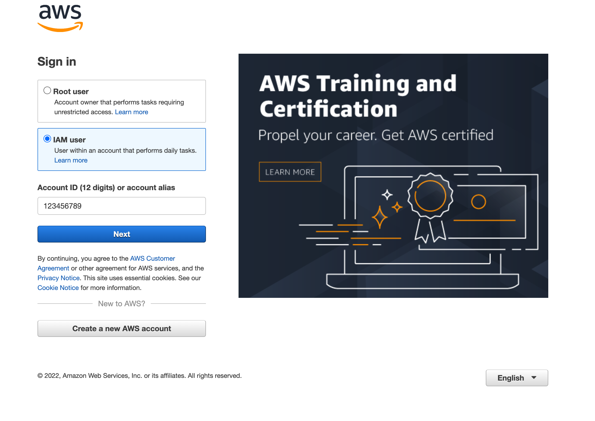
2. Once logged in, navigate to **Service Catalog** page. The list of options available in the left hand side menu will be limited as the **ServiceCatalogUser** is not an administrator. Click on the **Products** option to see the list of products available to you.
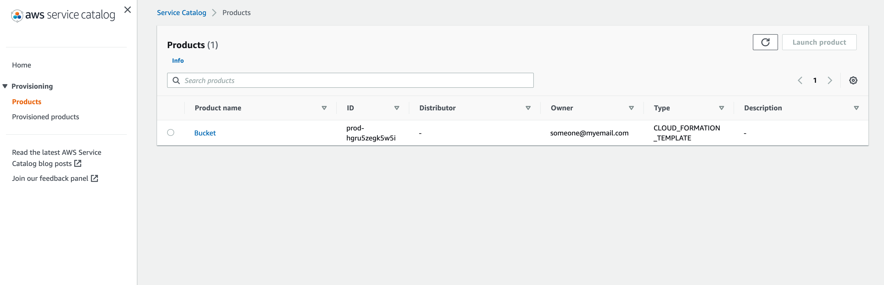
3. Select the **Bucket** product and then click **Launch product** botton. You will be asked to provide a name for this product instance but you can as well select the **Generate name** checkbox. Click **Launch product** button to provision the bucket.
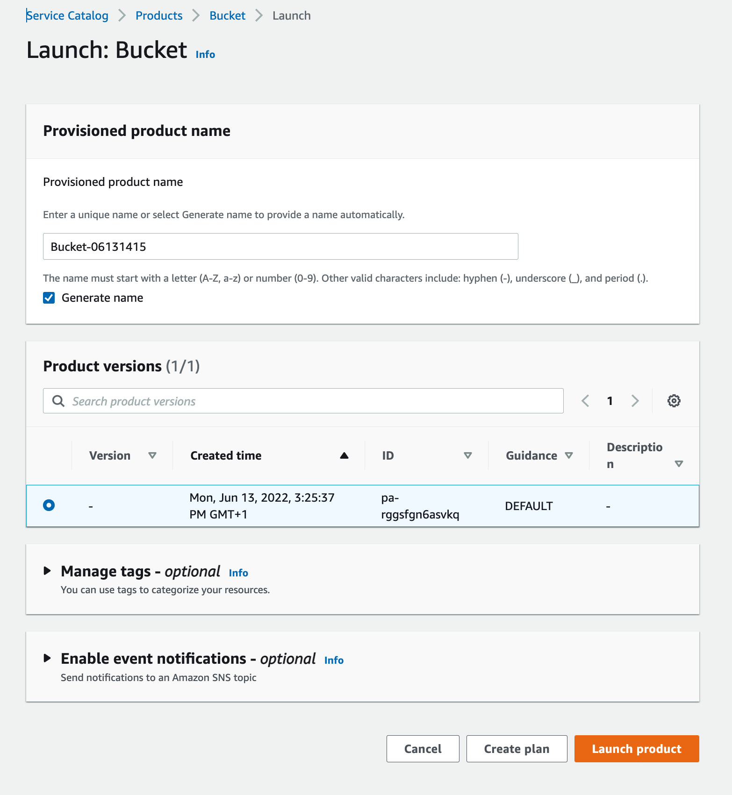
4. Once you the product has been provisioned, the **Provisioned products** screen will show its current state (you may need to refresh it a couple of times to track the progress)
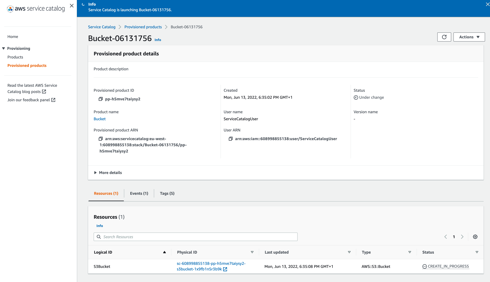
5. To delete the product, select it in the list of provisioned products and from the **Action** menu select **Terminate**

## Cleanup resources
To delete **ServiceCatalogUser**, execute following commands:
```
aws iam delete-login-profile --user-name ServiceCatalogUser
aws iam detach-user-policy --user-name ServiceCatalogUser --policy-arn arn:aws:iam::aws:policy/AmazonS3FullAccess
aws iam detach-user-policy --user-name ServiceCatalogUser --policy-arn arn:aws:iam::aws:policy/AWSServiceCatalogEndUserFullAccess
aws iam delete-user --user-name ServiceCatalogUser
```
In order to delete the product and portfolio, first make sure that the provisioned product is terminated. Then using AWS console perform following tasks:
1) Remove access to **Test** portfolio for **ServiceCatalogUser** account
2) Delete **Bucket** product from portfolio
3) Finally, delete **Test** portfolio
