# Exercise 5
This exercise illustrates use of **System's Manager** for remote access and automation of execution of scripts on EC2 instances. To start with, we will deploy an EC2 instance using cloud formation. The instance uses a role with a set of permissions which allow it to interact with **System's Manager**. Since the instance is based on Amazon Linux AMI, it comes with **System's Manager** agent preinstalled (one of the prerequisites for using System's Manager).

## Deployment of EC2 instance

Follow the steps below to deploy your sample EC2 instance:
1. In the AWS console navigate to **CloudFormation**. Click **Creater Stack** button and select **With new resources** option 

**NOTE**: Make sure you are in US-East-1 (Northern Virginia) region!

2. Select **Uplad a template file** radio button and then upload **ec2.yaml** file from the Exercise5 directory.
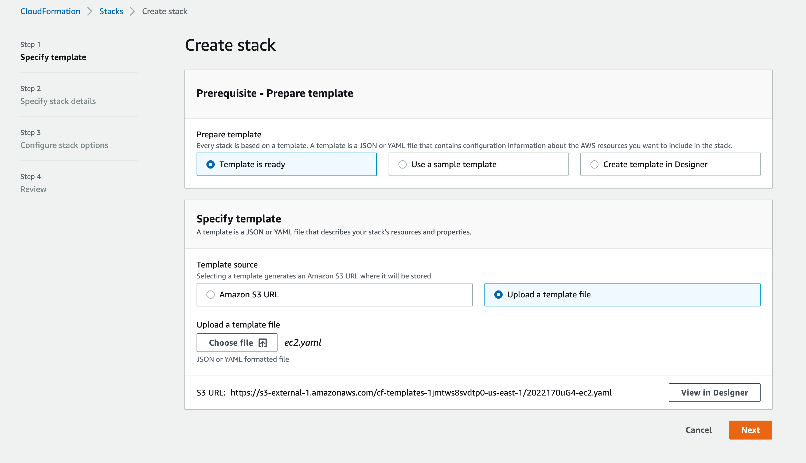
3. On the stack details screen, provide stack name and select default VPC and one of it's subnets. 
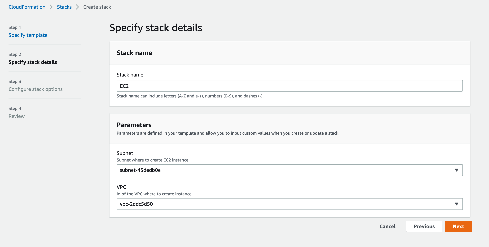
4. Click **Next** on the Stack options screen
5. At the bottom of the **Review** page select the checkbox allowing CloudFormation to create IAM resources.
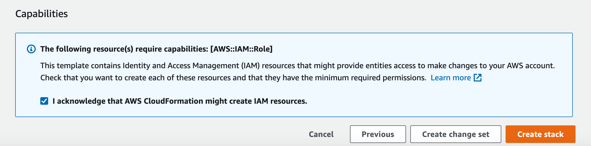

6. Once the stack has been deployed, we can verify that an EC2 instance named **Web Server**  has been created and is running. To check that this is the case, in the AWS console navigate to **EC2** and click on **Running instances** link:
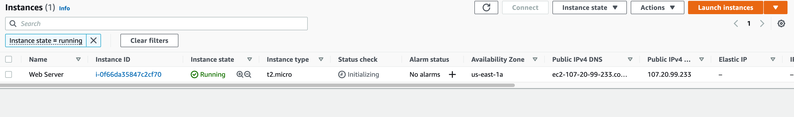

## Remote access using System Manager

The instance that we have deployed in the previous step, does not use SSH keys and has no SSH access. To access the instance, we will use System's Manager **Session Manager**. Follow the steps below to start a terminal session on the instance.
1. In the AWS console, navigate to **System's Manager** and select **Session Manager** from the left side menu. Click the **Start Session** button.
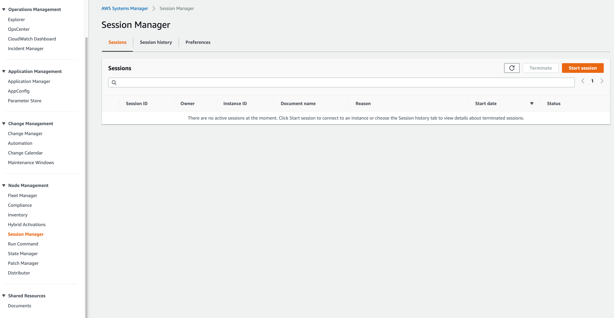
2. Select the **Web Server** instance and click **Start Session** button
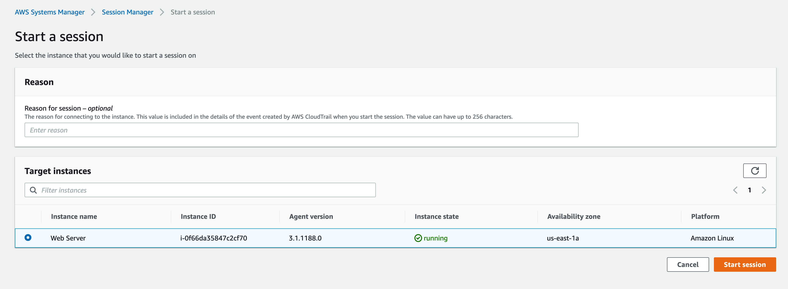
3. The session manager will open a terminal session in your browser. 
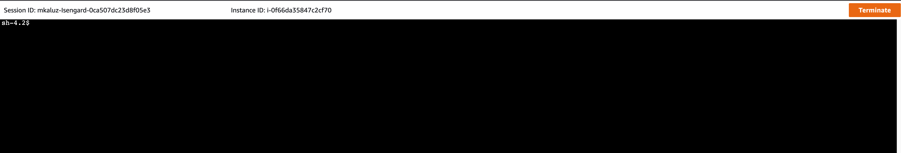
4. try executing some shell commands and click **Terminate** button to close your session when done.

**NOTE:**
You can open a session with Sesion manager in a number of different ways:
* Using aws cli command
```
aws ssm start-session --target >INSTANCE_ID<
```
* From the EC2 page, by clicking **Connect** button
* From she **Systems manager** page as we have shown above

This exercise illustrates that it is not necessary to use SSH to communicate and interact with your instance(s). SSH requires not only credentials which neeed to be managed appropriately, but also TCP port 22 to be open which is a target for hackers when exposed over the internet. Session manager works even if the instance has no Public IP therefore it is an easy way to interact with your EC2 instances.

## Automation of maintenance tasks using System Manager

In this task we will use **System's Manager** **Run Command** capability to remotely execute a shell script to install software on our instance. 
1. In the AWS console, navigate to **Systems Manager** service and from the letf side menu select **Run command** and click the **Run command** button.

2. You will be presented with a long list of possible commands, to narrow down the choice type **shell** in the search bar and press Enter.
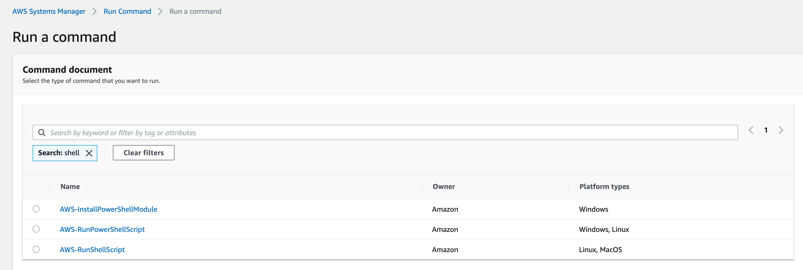
3. Select the **AWS-RunShellScript** command and in the **Command parameters** box type the following command:
```
yum install -y git
```
The intent of this command is to install **git** on your EC2 instance.

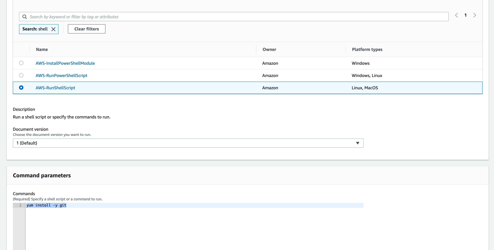

4. In the **Targets** section, select the **Chose instances manually** option and select the target instance:
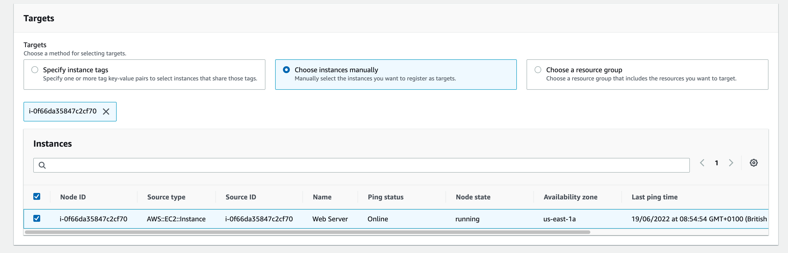

5. In the **Outputs options** section make sure that **Enable an S3 bucket** option is **NOT** selected. Click **Run** button to execute the command.
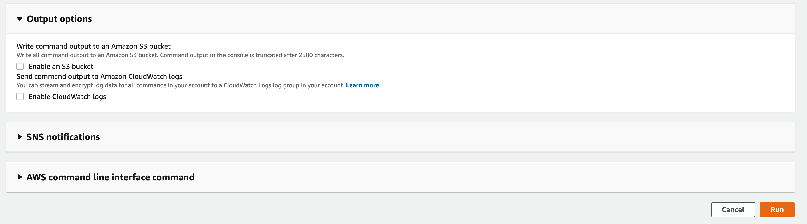
6. Once you click the **Run** button, you will be shown the status and progress of the command:
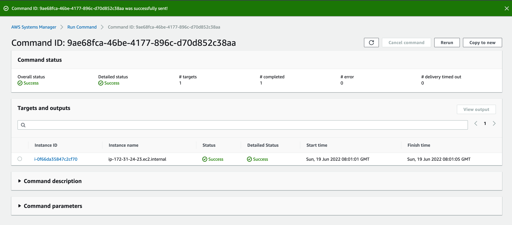
7. Click on the id of your instance to see more details of the command. Expand the **Output** section to see the results of the command.
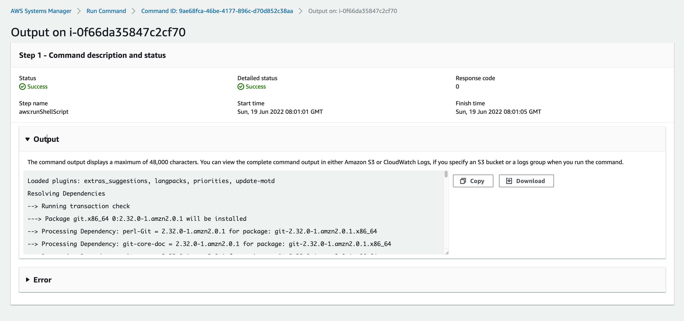

## Next steps
You can verify that git has been installed on your instance by opening a session and running 
```
git --version
``` 

You can try to execute the same command using **System's Manager** **Run Command** facility as we have shown above.
You can deploy more instances and try to run the command simultaneously on multiple instances and select them automatically using tag values.

When done, make sure to delete the cloud formation stack(s) to avoid being charged for your instance(s).